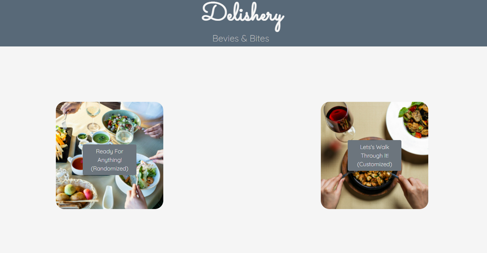

# [Delishery](https://adrianauch.github.io/Delishery/) Website

## Description of Project

This project was developed to aide anyone who loves to cook and create their own cocktails but is burdened with indecisiveness. Our Delishery website will walk through through a few simple questions and will present you with a randomized meal recipe and drink recipe. If you don't like the meal, you can start again and get completely new results! Once you find that perfect match, you can print the recipe off.

### index.html

- This project is composed of 3 html files. The homepage leads to the questions page. The questions page is "recycled" to append new questions without loading a new page. Once both questions are answered, then the user is redirected to the display page which holds the randomized recipes.

### style.css

- Bootstrap was used across all 3 html files. In addition to the bootstrap classes, custom CSS was added within all files where needed.

### script.js

- The JavaScript in this project utilized jQuery to minimize the amount of code required.
- This project made use of two API: [TheCocktailDB](https://www.thecocktaildb.com/api.php) & [TheMealDB](https://www.themealdb.com/api.php)

## Installation and Access

There is no required software installation necessary to access the code or GitHub published webpage. To access the webpage, either click the 'Delishery' link at the top of this readme or go to this link https://adrianauch.github.io/Delishery/. If accessing manually through the repository, click on the 'github-pages' link under the environments. From here, you can click on the version history of the website that you would like to see. To go directly to the deployed application, please click [here](https://adrianauch.github.io/Delishery/). Once you are on the deployed webpage, click on of the two buttons to get started - Image 1.

### Image 1

The index.html can be accessed [here](index.html), the style.css [here](./Assets/CSS/style.css), and the script.js [here](./JS/script.js).
Finalize these links - GitHub style and scripts should be moved into an assets folder

## Project Team

| [Adrian Auchterlonie](https://github.com/adrianauch) | [Brice Bridges](https://github.com/bcbridges) | [Brock Atwood](https://github.com/BrockAtwood) | [Matthew Hazelwood](https://github.com/Matthew-Hazelwood) |

## License

Copyright (C) 2021 Cave Connoisseurs - the full license can be viewed [here](license.txt)
